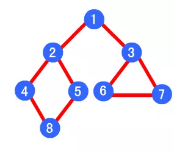

# Search Algorithm

problem 1:

 

problem 2: fig 2

 

##  depth-first search 

[python code]()

[matlab code]()

##  breadth-first search 

[python code]()

[matlab code]()

Travelling Salesman Problem (TSP)，它寻求的是旅行者由起点出发，通过所有给定的需求点后，再次返回起点所花费的最小路径成本

 动态规划算法（Dynamic Programming，简称DP）通常用于求解具有某种最优性质的问题，其基本思想是将待求解问题分解成若干个子问题，先求解子问题，然后由这些子问题的解再得到原问题的解。

代码

BFS DFS

广度优先和深度优先

  

深度优先遍历顺序为：1->2->4->8->5->3->6->7

广度优先遍历顺序为：1->2->3->4->5->6->7->8 

代码

python 和 matlab

我们会用到python中的集合（set），它是一个无序的不重复元素序列

